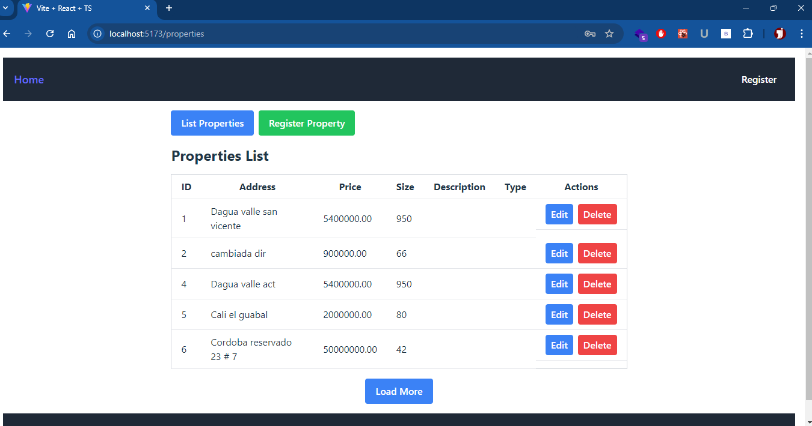

# Proyecto React + TypeScript + Vite

Este proyecto proporciona una configuración mínima para iniciar con React en Vite, con Hot Module Replacement (HMR) y algunas reglas básicas de ESLint.

## Presentacion



## Contenido del Proyecto

- **React**: Biblioteca para construir interfaces de usuario.
- **TypeScript**: Superset de JavaScript que añade tipado estático.
- **Vite**: Herramienta de construcción rápida para proyectos modernos.
- **ESLint**: Herramienta de linting para asegurar la calidad del código.

## Configuración del Proyecto

### Instalación de Dependencias

Para instalar las dependencias del proyecto, utiliza el siguiente comando:

```bash
npm install
```

o si usas YARN: 
```bash
yarn install
```

Ejecucion local
```bash
npm run dev
```

o si usas YARN: 
```bash
yarn dev
```

Esto iniciará un servidor de desarrollo en http://localhost:5173, con recarga automática (HMR) habilitada.


# Construcción para Producción

Para construir la aplicación para producción, usa el siguiente comando:

```bash
npm run dev
```

o si usas YARN: 
```bash
yarn dev
```

Los archivos construidos se colocarán en la carpeta dist, listos para ser desplegados en un servidor.

# Configuración de ESLint

1. Para una configuración de ESLint más avanzada, recomendamos actualizar la configuración para habilitar reglas de linting basadas en tipos:

```javascript
export default {
  // otras reglas...
  parserOptions: {
    ecmaVersion: 'latest',
    sourceType: 'module',
    project: ['./tsconfig.json', './tsconfig.node.json', './tsconfig.app.json'],
    tsconfigRootDir: __dirname,
  },
}
```

2. Reemplaza plugin:@typescript-eslint/recommended con plugin:@typescript-eslint/recommended-type-checked o plugin:@typescript-eslint/strict-type-checked.

3. Opcionalmente, añade plugin:@typescript-eslint/stylistic-type-checked.

4. Instala eslint-plugin-react y añade plugin:react/recommended y plugin:react/jsx-runtime a la lista de extends:
```javascript
extends: [
  // otras extensiones...
  'plugin:react/recommended',
  'plugin:react/jsx-runtime',
]

```


### Estructura del Proyecto
* src: Carpeta principal del código fuente.
* components: Componentes reutilizables de React.
* pages: Componentes de página para el enrutamiento.
* services: Servicios para interactuar con APIs y manejar lógica de negocio.
* styles: Archivos de estilo CSS/SCSS.
* utils: Utilidades y funciones auxiliares.
* App.tsx: Componente raíz de la aplicación.
* main.tsx: Archivo de entrada para Vite.
* public: Archivos estáticos y recursos públicos.
* tsconfig.json: Configuración de TypeScript.
* vite.config.ts: Configuración de Vite.
* .eslintrc.js: Configuración de ESLint.